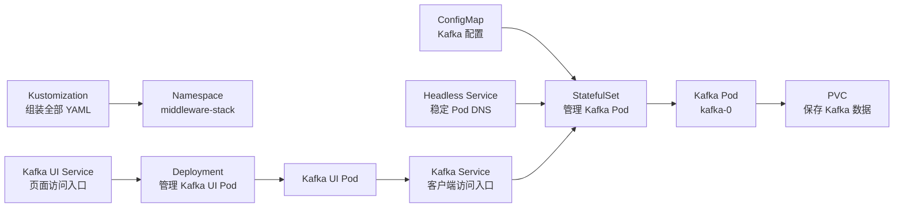

# Kafka Kubernetes 资源学习指南

本目录使用 Kubernetes 部署单节点 Kafka 和 Kafka UI。下面按资源解释它们“解决什么问题”以及在当前项目中如何配合。

## 资源关系



## Namespace：资源分组

Namespace 相当于集群中的逻辑工作区。当前所有 Kafka 资源都放在 `middleware-stack` 中，便于统一查询、授权、限制资源和清理。

```bash
kubectl get all -n middleware-stack
```

Namespace 不是默认的网络防火墙。若要限制不同 Namespace 之间的通信，还需要配置 NetworkPolicy。

## ConfigMap：保存非敏感配置

ConfigMap 将配置与容器镜像分离，修改 Kafka 节点 ID、监听器、分区数或 JVM 内存时，不需要重新制作镜像。`kafka-config` 中的键值通过 StatefulSet 的 `envFrom` 注入为容器环境变量。

```bash
kubectl get configmap kafka-config -n middleware-stack -o yaml
```

ConfigMap 不适合保存密码、Token 和证书；敏感数据应使用 Secret。修改 ConfigMap 后，已运行的 Pod 不一定自动重启，本项目可执行 `kubectl rollout restart statefulset/kafka -n middleware-stack` 让环境变量重新加载。

## Service：提供稳定访问地址

Pod IP 会随着重建发生变化，Service 使用标签选择 Pod，并提供稳定 DNS 和端口。

本项目有三个 Service：

- `kafka-headless`：`clusterIP: None`，不负责负载均衡，为 StatefulSet Pod 提供 `kafka-0.kafka-headless.middleware-stack.svc.cluster.local` 这样的稳定 DNS，供 KRaft Controller 使用。
- `kafka`：普通 ClusterIP Service，集群内客户端通过 `kafka.middleware-stack.svc.cluster.local:29092` 访问 Kafka。
- `kafka-ui`：把集群内的 `8080` 请求转发给 Kafka UI Pod。

Service 依靠 `selector` 与 Pod 的 `labels` 建立关系。两边标签不匹配时，Service 将没有 Endpoint。

```bash
kubectl get service,endpoints -n middleware-stack
```

## StatefulSet：管理有状态的 Kafka

StatefulSet 适合需要稳定身份和持久化数据的应用。它保证 Kafka Pod 使用固定名称 `kafka-0`，并通过 `volumeClaimTemplates` 为每个 Pod 创建独立 PVC。Pod 删除重建后，名称和存储关联仍然保持稳定。

Kafka 不使用 Deployment，主要因为 Broker 和 Controller 需要稳定节点身份、稳定 DNS 和持久磁盘。

```bash
kubectl get statefulset,pod -n middleware-stack
```

## Deployment：管理无状态的 Kafka UI

Deployment 负责维护指定数量的相同 Pod，并支持滚动更新和故障重建。Kafka UI 自身不保存关键业务数据，也不依赖固定 Pod 名称，所以适合使用 Deployment。

如果 Kafka UI Pod 被删除，Deployment 会自动创建一个新 Pod：

```bash
kubectl delete pod -l app.kubernetes.io/name=kafka-ui -n middleware-stack
```

## Pod：实际运行容器

Pod 是 Kubernetes 运行容器的最小调度单位。StatefulSet 和 Deployment 是管理者，最终真正运行 `apache/kafka` 和 `provectuslabs/kafka-ui` 镜像的是 Pod。

Pod 通常不应手工创建或修改，因为控制器会按照模板恢复期望状态。排查问题时常用：

```bash
kubectl get pods -n middleware-stack
kubectl describe pod kafka-0 -n middleware-stack
kubectl logs kafka-0 -n middleware-stack
```

## PVC：申请持久化存储

PersistentVolumeClaim（PVC）表示应用对存储的申请。Kafka StatefulSet 为 `kafka-0` 创建 PVC，并把它挂载到 `/var/lib/kafka/data`。因此 Pod 重建不会直接丢失 Topic、消息和消费者 Offset。

```bash
kubectl get pvc,pv -n middleware-stack
```

删除 StatefulSet 通常不会自动删除它创建的 PVC；删除 PVC 前应确认数据不再需要。底层 PV 是否一并删除取决于 StorageClass 的回收策略。

## 探针和资源限制

它们不是独立 Kubernetes 资源，而是 Pod 容器配置的重要组成部分：

- `startupProbe`：判断应用是否完成首次启动；成功前不会执行另外两种探针。
- `readinessProbe`：判断 Pod 是否可以接收 Service 流量，失败时不会立即重启容器。
- `livenessProbe`：判断应用是否卡死，持续失败时 kubelet 会重启容器。
- `resources.requests`：调度时预留的最低 CPU 和内存。
- `resources.limits`：容器允许运行时使用的资源上限。

## Kustomization：组装和转换清单

`kustomization.yaml` 不是部署到集群中的业务资源。它由 Kustomize 在本地读取，用于收集本目录的 YAML，并统一注入 `middleware-stack` Namespace。

```bash
# 查看最终生成的清单，不修改集群
kubectl kustomize k8s/kafka

# 部署全部资源
kubectl apply -k k8s/kafka

# 删除清单中管理的资源
kubectl delete -k k8s/kafka
```

注意：当前 Kustomization 包含 `namespace.yaml`，因此最后一条命令会删除整个 `middleware-stack` Namespace，其中的 PVC 和其他 namespaced 资源也会被删除。执行前应确认不再需要 Kafka 数据。

其中 `namespace: middleware-stack` 只负责指定资源放在哪里，真正创建 Namespace 的仍是 `namespace.yaml`。

## 一次请求经过哪些资源

以 Kafka UI 读取 Kafka Topic 为例：

1. 用户通过 `kubectl port-forward service/kafka-ui 8080:8080` 打开页面。
2. `kafka-ui` Service 把请求转发给 Kafka UI Pod。
3. Kafka UI Pod 通过 `kafka.middleware-stack.svc.cluster.local:29092` 请求 Kafka Service。
4. Kafka Service 根据标签把连接转发给 `kafka-0` Pod。
5. Kafka Pod 从 PVC 挂载的数据目录读取 Topic 和消息。
